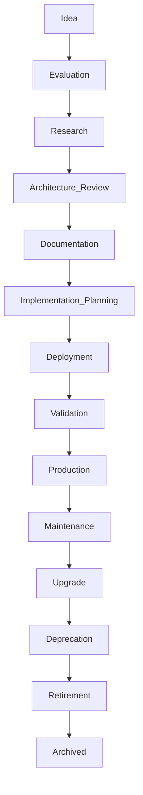

# Service Lifecycle Standard v1.0

## Purpose
The Service Lifecycle Standard defines the governance framework that governs **every** service in the homelab from the moment it is discovered until it is permanently retired. It ensures that services are managed with **consistency, repeatability, maintainability, auditability, recoverability, automation readiness, and AI‑assisted governance**.

## Lifecycle Objectives
The lifecycle exists to achieve the following objectives:

- **Consistency** – Uniform processes across all services regardless of technology stack.  
- **Repeatability** – Every service follows a repeatable set of steps that can be reproduced.  
- **Maintainability** – Services remain easy to operate, update, and troubleshoot throughout their existence.  
- **Auditability** – All actions are documented and can be reviewed by auditors or AI agents.  
- **Recoverability** – Services have defined rollback and disaster‑recovery procedures.  
- **Automation Readiness** – Stages, inputs, and outputs are expressed to enable future AI‑driven automation.  
- **AI‑Assisted Governance** – AI agents may generate artifacts, perform validations, and raise escalations in accordance with the AI rules defined in the Documentation Standard.

## Scope
This standard applies to **all** services managed in the homelab, irrespective of deployment method. The scope includes, but is not limited to:

- Infrastructure  
- Networking  
- AI  
- Monitoring  
- Automation  
- Storage  
- Media  
- Productivity  
- Development  
- Security  
- Utilities  

## Service Lifecycle Philosophy
- Every service begins as an **evaluation**.  
- No service reaches production without documented approval.  
- Every deployed service must be maintainable.  
- Every service has a clearly assigned **owner**.  
- Every service must eventually be **retired or replaced**.  
- Services must always have an **exit strategy**.

## Service Lifecycle
The complete lifecycle consists of the following stages. Each stage includes **Purpose, Inputs, Outputs, Entry Criteria, Exit Criteria, Failure Conditions, Rollback/Escalation, Responsible Role, and Expected Outputs**.

### Idea
**Purpose:** Capture a raw concept for a new service.  
**Inputs:** • Service idea description  
**Outputs:** • Idea record (internal ticket)  

### Evaluation
**Purpose:** Perform an initial feasibility assessment.  
**Inputs:** • Idea record, preliminary requirements  
**Outputs:** • Evaluation report, recommendation (Proceed/Discard)  

### Research
**Purpose:** Gather detailed requirements, constraints, and alternatives.  
**Inputs:** • Evaluation report, stakeholder interviews, market analysis  
**Outputs:** • Detailed requirements, initial ADR draft  

### Architecture Review
**Purpose:** Validate the proposed design against homelab architecture principles.  
**Inputs:** • Detailed requirements, preliminary design artifacts  
**Outputs:** • Architecture approval, updated ADR  

### Documentation
**Purpose:** Produce the core service documentation required for downstream stages.  
**Inputs:** • Approved architecture, functional specifications  
**Outputs:** • Service README, ADR, Runbook (draft)  

### Implementation Planning
**Purpose:** Define concrete implementation tasks, timelines, and resources.  
**Inputs:** • Documentation package, resource plan  
**Outputs:** • Implementation plan, CI/CD pipeline design (if applicable)  

### Deployment
**Purpose:** Deploy the service into a controlled environment.  
**Inputs:** • Implementation plan, compose files, environment templates  
**Outputs:** • Deployed instance, deployment logs  

### Validation
**Purpose:** Verify that the deployed service meets all functional and non‑functional requirements.  
**Inputs:** • Deployed instance, test suites, validation criteria  
**Outputs:** • Validation report, approved runbook  

### Production
**Purpose:** Transition the service to live operation.  
**Inputs:** • Validated service, approved runbook, monitoring configuration  
**Outputs:** • Production‑ready service, operational metrics  

### Maintenance
**Purpose:** Ongoing upkeep, patching, and minor enhancements.  
**Inputs:** • Production service, change requests  
**Outputs:** • Updated service version, maintenance logs  

### Upgrade
**Purpose:** Perform major version upgrades or architectural changes.  
**Inputs:** • Upgrade plan, compatibility analysis  
**Outputs:** • Upgraded service, migration documentation  

### Deprecation
**Purpose:** Mark the service as slated for retirement.  
**Inputs:** • Business decision, usage metrics  
**Outputs:** • Deprecation notice, migration path  

### Retirement
**Purpose:** Safely shut down the service and archive its artifacts.  
**Inputs:** • Deprecation notice, migration completion evidence  
**Outputs:** • Service shutdown, archived documentation, updated Service Index  

### Archived
**Purpose:** Preserve the service’s historical record for audit purposes.  
**Inputs:** • All archived artifacts  
**Outputs:** • Permanent record in the Service Index  

## Lifecycle Gates
Each transition between stages is protected by a **gate** that must satisfy the following attributes:

- **Purpose** – Reason for the gate.  
- **Validation** – How the gate is verified (manual review, automated test, etc.).  
- **Required Artifacts** – Documents or files needed to pass.  
- **Required Standards** – Which existing standards apply (referenced via *Document Title → Section Name*).  
- **Approval Required** – Yes/No.  
- **Automated Validation Possible** – Yes/No.

*Example Gate – Architecture Review → Documentation*  

- Purpose: Ensure the design aligns with homelab architecture principles.  
- Validation: Architecture Owner reviews ADR and design diagrams.  
- Required Artifacts: ADR, design diagram.  
- Required Standards: **Homelab Architecture Standard → Governance Model**.  
- Approval Required: Yes (Architecture Owner).  
- Automated Validation Possible: No (subjective architectural judgment).

(Analogous gate definitions exist for every stage transition.)

## Stage Ownership Matrix
| Stage               | Responsible          | Reviewer          | Approver          | Informed          |
|---------------------|----------------------|-------------------|-------------------|-------------------|
| Idea                | Service Owner        | –                 | –                 | Architecture Owner |
| Evaluation          | Service Owner        | Reviewer          | Approver          | Architecture Owner |
| Research            | Service Owner        | Reviewer          | Approver          | Architecture Owner |
| Architecture Review | Architecture Owner   | Reviewer          | Approver          | Service Owner |
| Documentation       | Document Owner       | Reviewer          | Approver          | Service Owner |
| Implementation Planning | Service Owner   | Reviewer          | Approver          | Architecture Owner |
| Deployment          | Service Owner        | Reviewer          | Approver          | Architecture Owner |
| Validation          | Service Owner        | Reviewer          | Approver          | Architecture Owner |
| Production          | Service Owner        | Reviewer          | Approver          | Architecture Owner |
| Maintenance         | Service Owner        | Reviewer          | –                 | Architecture Owner |
| Upgrade             | Service Owner        | Reviewer          | Approver          | Architecture Owner |
| Deprecation         | Service Owner        | Reviewer          | Approver          | Architecture Owner |
| Retirement          | Service Owner        | Reviewer          | Approver          | Architecture Owner |
| Archived            | Document Owner       | –                 | –                 | Architecture Owner |

## Required Documentation
| Stage               | Documentation Artifacts (must exist) |
|---------------------|--------------------------------------|
| Evaluation          | ADR (Evaluation) |
| Research            | Requirements Document, ADR (Research) |
| Architecture Review | ADR (Architecture), Design Diagrams |
| Documentation       | Service README, ADR (Final), Runbook |
| Implementation Planning | Implementation Plan, CI/CD Blueprint |
| Deployment          | Deploy Scripts, Compose Files, .env.example |
| Validation          | Validation Report, Test Results, Runbook (final) |
| Production          | Production Checklist, Audit Report, Version History |
| Maintenance         | Maintenance Log, Change Requests |
| Upgrade             | Upgrade Plan, Migration Guide |
| Deprecation         | Deprecation Notice, Migration Path |
| Retirement          | Retirement Checklist, Data Export, Archive Package |
| Archived            | Archived Artifacts (README, ADR, Runbook, Audit) |

*References:* **Documentation Standard → Artifact Requirements** (no duplication).

## Artifact Creation Timeline
- **Idea** – Idea record.  
- **Evaluation** – Evaluation ADR draft.  
- **Research** – Requirements doc, ADR (Research).  
- **Architecture Review** – Architecture ADR, design diagrams.  
- **Documentation** – Service README, final ADR, Runbook (draft).  
- **Implementation Planning** – Implementation plan, CI/CD design.  
- **Deployment** – Compose files, environment templates (.env.example).  
- **Validation** – Validation report, test suites, final Runbook.  
- **Production** – Audit report, version history, monitoring config.  
- **Retirement** – Migration plan, data export, archive package.  

## Required Standards
| Stage               | Applicable Standards |
|---------------------|----------------------|
| Architecture Review | Homelab Architecture Standard |
| Deployment          | Docker Compose Standard |
| Documentation      | Documentation Standard |
| Validation          | Documentation Standard, Docker Compose Standard |
| Retirement          | Documentation Standard |

*Future standards (Security, Backup, Monitoring, Networking, Storage, Secrets) will extend this matrix as they are released.*

## Service States vs. Lifecycle Stage
| Lifecycle Stage | Operational Status |
|-----------------|--------------------|
| Idea            | Not yet provisioned |
| Evaluation      | Offline / Planning |
| Research        | Offline / Research |
| Architecture Review | Offline / Reviewing |
| Documentation   | Offline / Drafting |
| Implementation Planning | Offline / Planned |
| Deployment      | Testing |
| Validation      | Testing |
| Production      | Healthy |
| Maintenance     | Running |
| Upgrade         | Updating |
| Deprecation     | Degraded / Sunset |
| Retirement      | Shutdown |
| Archived        | Archived (inactive) |

## Service Risk Classification
| Classification | Description |
|----------------|-------------|
| Critical       | Service is essential for core operations; downtime unacceptable. |
| Important      | Service is important but tolerates brief interruptions. |
| Standard       | Normal service with standard SLA. |
| Experimental   | Prototype or proof‑of‑concept; limited impact. |
| Prototype      | Early‑stage development, not yet production‑ready. |

*No technical constraints are imposed; future standards may add requirements.*

## Exception Handling
When a lifecycle step must be **skipped** or **modified**, the following procedure applies:

1. **Request** – Service Owner submits an Exception Request documenting the reason.  
2. **Review** – Architecture Owner and Reviewer evaluate the request.  
3. **Approval** – Approver (Architecture Owner or designated Authority) grants an exception.  
4. **Documentation** – Exception is recorded in the Service Index and linked to the affected service.  
5. **Re‑evaluation** – Exceptions are revisited at the next scheduled audit.  

*Reference:* **Homelab Architecture Standard → Governance**.

## Continuous Improvement
After Production, services enter a perpetual improvement loop:

- **Maintenance** – Apply patches, minor enhancements.  
- **Review** – Periodic architecture and security reviews.  
- **Audit** – Verify compliance with standards.  
- **Upgrade** – Major version or architectural changes.  
- **Optimization** – Performance tuning, cost reduction.  

The loop feeds back into **Maintenance**, ensuring the lifecycle never truly ends at Production.

## AI Workflow
For each stage, AI participation is defined according to **Documentation Standard → AI Documentation Rules**.

| Stage               | AI May                                        | AI Must Not                              | AI Must Escalate                      |
|---------------------|-----------------------------------------------|------------------------------------------|---------------------------------------|
| Evaluation          | Generate preliminary evaluation summary.      | Approve or reject the service.           | Escalate conflicts with existing services. |
| Research            | Compile requirement drafts, fetch public data. | Make final design decisions.             | Escalate missing critical requirements. |
| Architecture Review | Validate diagram consistency, suggest alternatives. | Override Architecture Owner decisions. | Escalate architectural conflicts. |
| Documentation       | Draft README, ADR templates.                  | Publish documentation without review.   | Escalate incomplete or contradictory sections. |
| Implementation Planning | Produce implementation checklist.          | Deploy without human sign‑off.           | Escalate missing resource allocations. |
| Deployment          | Run automated deployment scripts in sandbox. | Approve production deployment.           | Escalate deployment failures. |
| Validation          | Execute test suites, generate reports.       | Mark validation as passed without evidence. | Escalate failed health checks. |
| Production          | Update monitoring dashboards.                | Approve production launch.               | Escalate security findings. |
| Maintenance/Upgrade | Suggest patch versions, generate changelogs. | Apply patches without owner consent.     | Escalate high‑risk changes. |
| Retirement          | Archive artifacts, verify backup integrity.   | Delete resources without audit.          | Escalate data loss risks. |

## Service Decision Tree
```
Idea
|
v
Research
|
v
Worth pursuing?
├─ No → Archive
└─ Yes
   |
   v
Architecture Review
|
v
Approved?
├─ No → Revise
└─ Yes
   |
   v
Documentation
|
v
Implementation Planning
|
v
Deployment
|
v
Validation
|
v
Production
|
v
Maintenance
|
v
Upgrade?
├─ No → Continue Maintenance
└─ Yes
   |
   v
Deprecation
|
v
Retirement
|
v
Archived
```

## Service Inventory
Every discovered service **MUST** be entered into the **Service Index** before entering the lifecycle.

**Minimum information required for each entry:**

- **Name** – Human‑readable identifier.  
- **Category** – One of the domains listed in the Scope section.  
- **Current Lifecycle Stage** – Stage the service currently occupies.  
- **Operational Status** – Offline, Testing, Healthy, Running, Degraded, etc.  
- **Owner** – Governance role responsible for the service.  
- **Source** – Origin of the service definition (e.g., Git repo, marketplace, manual).  
- **Evaluation Status** – Result of the most recent evaluation (Pending, Approved, Rejected).  

The Service Index is the authoritative inventory of every service known to the homelab. Services **MUST NOT** bypass the Service Index; any addition, modification, or removal must be recorded there and approved according to the applicable lifecycle gate.

*Reference:* **Homelab Architecture Standard → Service Index Governance**.

## Future Standards Integration
Future standards (Security Standard, Backup Standard, Monitoring Standard, Networking Standard, Storage Standard, Secrets Standard) will extend the lifecycle requirements by adding additional gates, artifact requirements, and validation criteria. This document anticipates those integrations without defining them.

## Definition of Done
A service reaches **Production** only when **all** of the following are satisfied:

- Every lifecycle gate from Idea through Production has passed.  
- Required documentation for each stage exists and is approved.  
- All applicable standards are satisfied (referenced via *Document Title → Section Name*).  
- Validation checklist is complete and passed.  
- Rollback procedures have been verified.  
- Backups are tested and verified.  
- Monitoring is configured and operational.  
- A responsible owner is assigned.  
- Formal approval is recorded in the Service Index.

## Appendices
### Glossary
*Lifecycle Stage* – A defined phase in the service’s governance process.  
*Operational Status* – The runtime condition of the service.  
*Service Index* – Central inventory of all services.  

### Lifecycle Diagram
*(Mermaid diagram placeholder – to be rendered in supporting tools)*  



### Example Lifecycle
*Example service “AI‑Chat‑Bot”* – shows filled‑in artifacts, owners, and status at each stage.

### Role Definitions
- **Architecture Owner** – Oversees architectural compliance.  
- **Service Owner** – Responsible for the service’s day‑to‑day operation.  
- **Document Owner** – Maintains documentation artifacts.  
- **Reviewer** – Performs peer review of artifacts.  
- **Approver** – Grants final sign‑off for gates.  
- **AI Agent** – Executes AI‑defined tasks under the constraints above.  

### Artifact Matrix
| Artifact                | Creation Stage |
|-------------------------|-----------------|
| Idea Record             | Idea |
| Evaluation ADR          | Evaluation |
| Requirements Document   | Research |
| Architecture ADR        | Architecture Review |
| Service README           | Documentation |
| Implementation Plan     | Implementation Planning |
| Compose File             | Deployment |
| Validation Report       | Validation |
| Audit Report             | Production |
| Retirement Checklist    | Retirement |
| Archived Package        | Archived |

---

*All cross‑references use the format **Document Title → Section Name** to avoid duplication of governance content.*